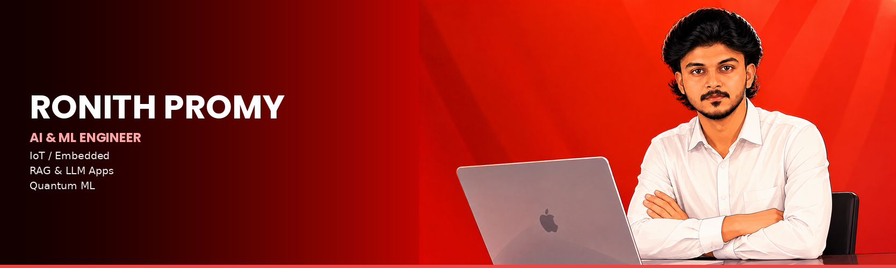

<!-- ========================================= -->
<!--            GITHUB PROFILE README          -->
<!-- ========================================= -->

 

---

## About Me

AI & Machine Learning undergraduate at **Mar Athanasius College of Engineering** (2023–27). Passionate about intelligent systems, IoT, embedded devices, and turning research ideas into working hardware + software.

- 🏆 **1st Prize Winner** — ASME MACE Vajra Hackathon (secure IoT Hybrid EV Scooter Telematics System)
- 💼 **AI Customer Interaction Solutions Intern** — Voxtron Solutions LLP (LLMs, prompt engineering, RAG)
- 💰 Awarded **₹1.5 lakh project funding** by MACE for an EEG-based research project
- 🔭 Currently building: a Quantum ML framework for EEG-based meditation state classification
- 💬 Ask me about **Python, ESP32/IoT, RAG, LangChain, TensorFlow, PyTorch, Embedded Systems**

---

## Tech Stack

---

## Featured Projects

| Project | Description |
|---------|-------------|
| **[Hybrid EV Scooter Telematics System](https://github.com/RIP00xX)** | Secure IoT vehicle telematics platform using **ESP32 + MQTTS**, encrypted vehicle-to-server comms, dynamic/static telemetry separation (**30% bandwidth reduction**), and **45ms** real-time command latency. *(Vajra Hackathon — 1st Prize)* |
| **[Smart AI-Powered Rubber Plantation Monitoring](https://github.com/RIP00xX)** | Multimodal monitoring platform with **ESP32 IoT sensing**, deep-learning disease detection, **RAG-powered** decision support, GAN-enhanced training, and a Grok API chatbot — **95% detection accuracy**, **94.2% F1-score**. |
| **[AI-Powered Pet Store Management System](https://github.com/RIP00xX)** | Full-stack platform (**React, MySQL, MongoDB**) for managing pets and connecting with retailers — REST API backend, CRUD operations, authentication, and real-time updates. |
| **[Quantum-Enhanced EEG Meditation State Analysis](https://github.com/RIP00xX)** *(Ongoing)* | Multimodal Quantum ML framework (**Qiskit, TensorFlow, PyTorch**) fusing EEG, ECG, heart rate, and SpO₂ signals to classify meditation states and predict cognitive transitions. |

---

## Experience & Achievements

- 🏆 **1st Prize — ASME MACE Vajra Hackathon:** Led development of a full-stack IoT-based Hybrid EV Scooter Telematics app with real-time monitoring, secure remote control, and geofencing.
- 🤖 **AI Customer Interaction Solutions Intern — Voxtron Solutions LLP (Jun 2026):** Built AI chatbot features using LLMs, prompt engineering, and RAG; developed NLP pipelines for intent classification and entity extraction.
- 💰 **₹1.5 Lakh Project Grant — MACE:** Funded for an EEG-based research project, including EEG hardware procurement.
- 🎓 **Academic Toppers:** School topper in Computer Science (Class XII) and Mathematics (Class X).

<b>📜 Certifications</b>

 

- Advanced Ethical Hacking & Cyber Defense — Techmaghi (2024)
- Prompt Engineering Workshop — AccelerateX & YouData.ai (2024)
- Foundational AI Project Internship — AccelerateX (2024)
- Programming in Python — Coursera (2023)
- Programming in C++ — GTech (2023)

---

## GitHub Analytics

---

## Connect With Me

---

